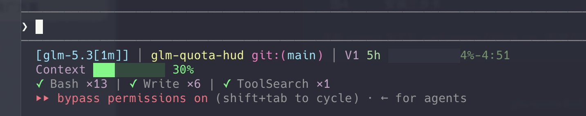
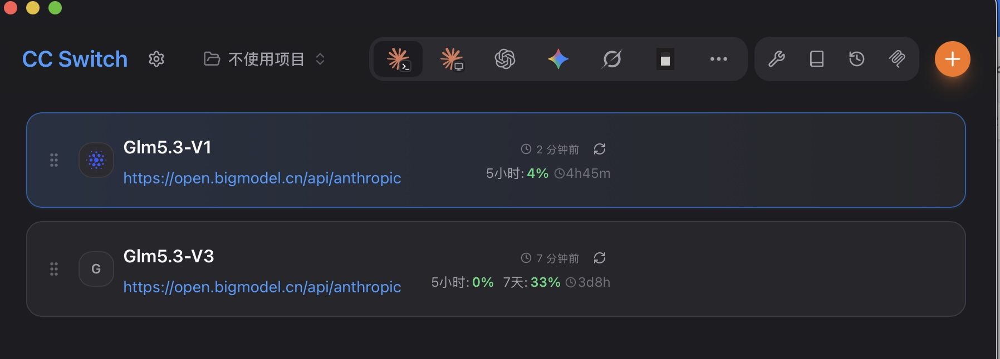

# glm-quota-hud

> See your GLM Coding Plan quota at a glance in the Claude Code status bar — colorful progress bars & countdowns for 5h windows and weekly credit pools, dual-account

中文 | [中文文档](README.md)

## What it looks like

In the Claude Code status bar (GLM quota segment alongside the Context bar, usage-tiered colors):



```
V1 5h ░░░░░ 1%-3:55 · V3 5h ██░░░ 40%-3:56 周29%-4d
      purple slots, green = healthy;  colors shift green→yellow→red at 70%/85% usage
```

CLI mode (pairs with [cc-switch](https://github.com/farion1231/cc-switch) account switching):

```
◆ GLM Coding Plan quota overview  08-24 08:17
────────────────────────────────────────────────────
V1 (5h-window plan)
  5h  ░░░░░░░░░░░░░░░░░░░░   1%  resets in 4:55
  mcp ░░░░░░░░░░░░░░░░░░░░   1%  resets 08-31 10:32
V3 (credit plan) ← current session
  weekly ███████░░░░░░░░░░░  33%  resets 08-27 17:00
────────────────────────────────────────────────────
```

## Features

- Dual-account parallel probing (5h-window plan + credit plan), 120s cache
- Three pool semantics: 5h window / weekly credits / MCP weekly (incl. the hidden rule: inactive windows are not returned by the API)
- Usage-tiered colors (Catppuccin Mocha, configurable): green <70 / yellow 70-85 / red ≥85
- Precise countdowns: minutes for 5h windows, days + absolute time for weekly pools
- CLI mode works without claude-hud — check all windows before/after switching accounts
- Zero dependencies — pure Python stdlib, single file
- Secure — tokens live in env vars (`~/.zshrc.secrets`), never in git; the SGR patch keeps sanitize's injection defenses intact

## Quick start

```bash
git clone https://github.com/FrizzleFur/glm-quota-hud.git
cd glm-quota-hud
bash install.sh
```

Add tokens to `~/.zshrc.secrets`:

```bash
export GLM_V1_TOKEN="your-5h-window-plan-token"
export GLM_V3_TOKEN="your-credit-plan-token"
```

Then follow the `--extra-cmd` example printed by `install.sh` to wire it into your
statusLine in `~/.claude/settings.json`. Restart the terminal.

Single-account users: one token is enough, the other account is skipped automatically.

## With cc-switch

The pain of juggling multiple GLM accounts with [cc-switch](https://github.com/farion1231/cc-switch):
**you switch over only to find the 5h window is exhausted**. CLI mode answers exactly that:



> cc-switch handles account switching & quota cards; glm-quota-hud puts quota into an
always-visible status bar — together they form a complete workflow.

```bash
python3 ~/.claude/plugins/claude-hud/glm_quota_hud.py --mode cli --refresh
```

## How the colors work (SGR whitelist patch)

claude-hud sanitizes `--extra-cmd` output and strips **all** ANSI escapes (an anti-injection
safety measure), so extra segments are dim-grey by nature. `patch-sgr.sh` patches its dist
with a minimal whitelist — pass through `38;2` (truecolor) / `0` / `1` / `2` / `22` SGR codes
only; **OSC / C0 / bidi / everything else still stripped**. Idempotent — re-run after claude-hud upgrades:

```bash
bash ~/.claude/plugins/claude-hud/patch-sgr.sh
```

Skip the patch if you don't want colors; the script degrades to plain text gracefully.

## FAQ

**Why does my credit-plan account sometimes show no 5h window?**
GLM only returns the window pool while it's active (recent requests). Gone after expiry with
no new requests — send one message and `--refresh`.

**Support providers other than GLM?**
The architecture separates probing / parsing / rendering (see `parse_glm`). A new provider is
one parser function away. GLM-only for v1 — PRs welcome.

## License

MIT
